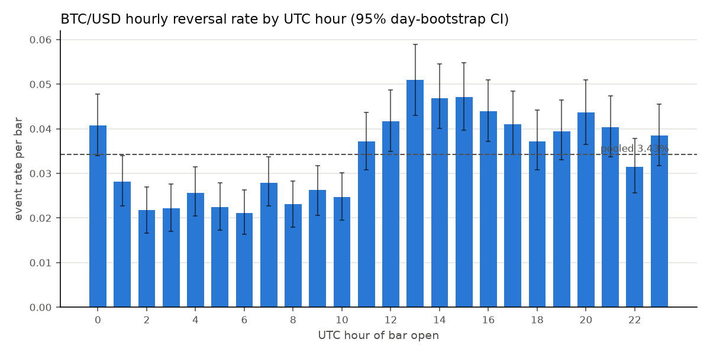
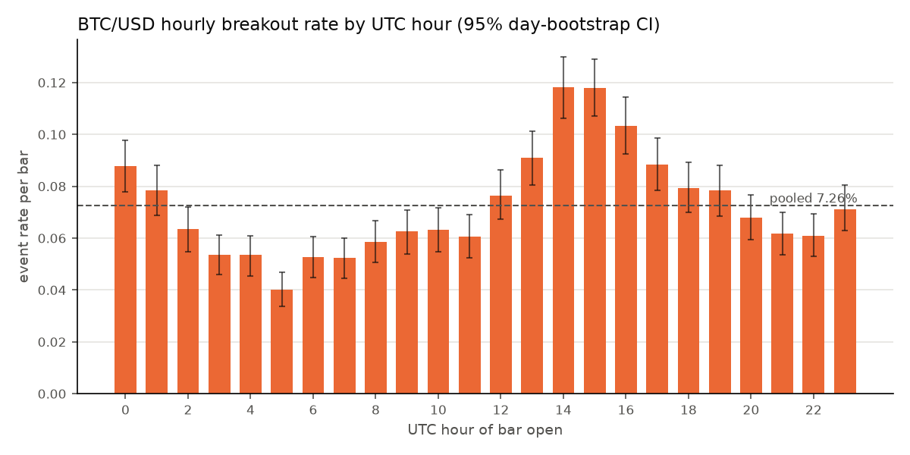
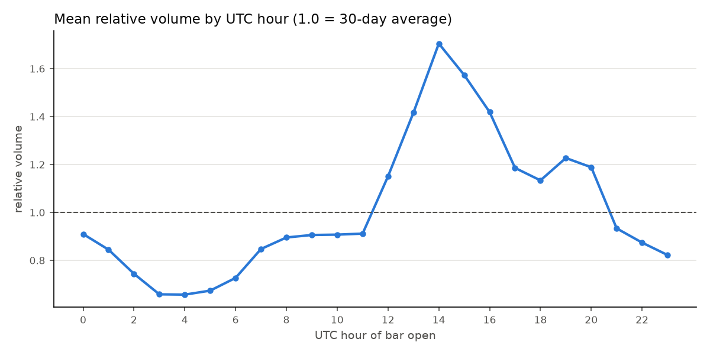
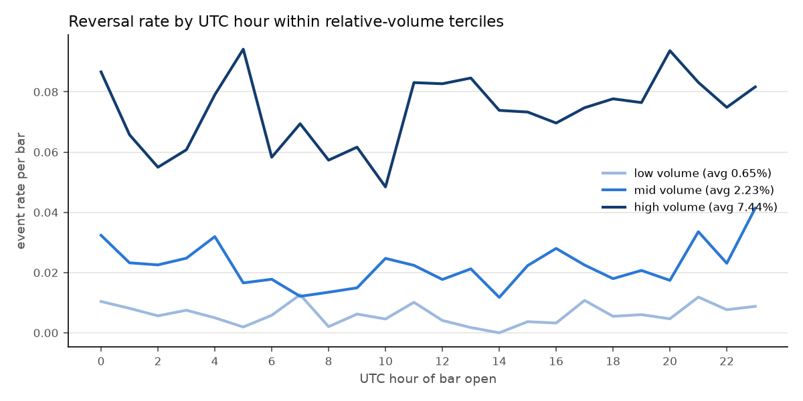
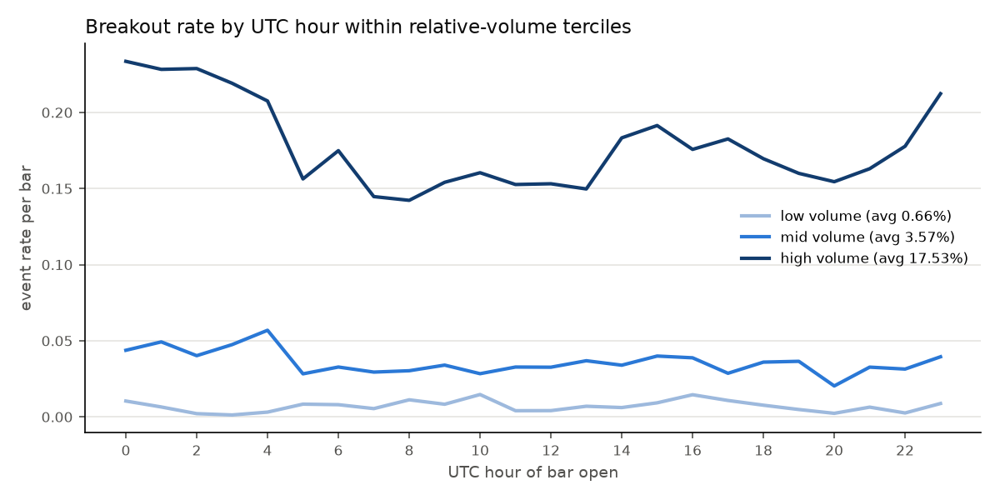

# Do certain hours carry more BTC/USD inflections — and is it clock or volume?

**Data:** Bitstamp BTC/USD, 74,863 hourly candles, 2018-01-01 → 2026-07-17 (all times UTC).
**Code:** [`scripts/analysis.py`](scripts/analysis.py) · machine-readable results in [`results/summary.json`](results/summary.json)

## TL;DR

1. **Yes, inflections cluster by clock hour — strongly and stably.** Both
   reversals and breakouts peak during the US session (13:00–17:00 UTC) at
   1.3–1.6× the average rate, trough during the Asian session (02:00–08:00 UTC)
   at 0.55–0.75× average, and show a distinct local spike at exactly 00:00 UTC.
   Chi-square vs a uniform clock: p ≈ 5×10⁻²⁸ (reversals), p ≈ 2×10⁻⁷²
   (breakouts). The hourly profile is stable across the 2018–2022 vs 2022–2026
   halves (Spearman ρ ≈ 0.61–0.65, p < 0.002).
2. **It is mostly a volume/liquidity phenomenon, not the clock itself** —
   contemporaneous relative volume explains 10–20× more deviance than hour
   dummies — **but the clock is not fully absorbed**: a highly significant
   hour effect survives volume control, and the 00:00 UTC spike happens on
   *below-average* volume, which is a pure clock artifact (daily candle close +
   perpetual-futures funding timestamp).
3. **For prediction (volume known before the bar), hour and volume are
   roughly equal partners.** Lagged relative volume and hour dummies each add
   independent, significant information; for breakouts their pseudo-R²s are
   nearly identical (≈0.010 vs ≈0.011).
4. **The most interesting interaction:** conditioning on high relative volume
   *inverts* the hourly pattern — a volume anomaly during the quiet Asian hours
   is a much stronger inflection signal than the same volume during US hours,
   because it is a much larger deviation from that hour's norm. The informative
   variable is *volume surprise relative to the hour's seasonal baseline*, not
   raw volume and not the clock alone.
5. Hour-of-day seasonality in crypto returns/volatility/volume is well
   documented in the academic literature (see [Prior research](#prior-research)),
   but published work focuses on return/volatility/volume seasonality —
   framing it specifically as *inflection* (reversal/breakout) timing, and
   decomposing clock vs volume for that, is where this analysis adds something.

---

## 1. Definitions

Two event types, flagged on hourly bars (hour = bar open, UTC):

- **Reversal** — bar *t* is a confirmed local extremum of closes over
  [*t*−3, *t*+3], and both the move into and out of the extremum exceed
  0.75× the trailing 30-day std of hourly log returns. The volatility-adaptive
  threshold prevents the detector from simply flagging high-volatility hours.
  ⚠️ Confirmation uses 3 future bars — this is a descriptive label for *where
  turns happen*, not a real-time signal.
- **Breakout** — close exceeds the max high (or min low) of the prior 24 bars
  (Donchian-24, "new daily-range extreme"). This one is real-time.

2,568 reversals (3.43% of bars) and 5,433 breakouts (7.26% of bars).

## 2. The hourly pattern

| | Reversals | Breakouts |
|---|---|---|
| Pooled rate | 3.43% | 7.26% |
| Chi-square vs uniform | 189.1, p = 4.6×10⁻²⁸ | 409.6, p = 1.9×10⁻⁷² |
| Top hours (lift vs pooled) | 13:00 (1.49×), 15:00 (1.37×), 14:00 (1.36×), 16:00 (1.28×), 20:00 (1.27×) | 14:00 (1.63×), 15:00 (1.63×), 16:00 (1.42×), 13:00 (1.25×), 17:00 (1.22×) |
| Bottom hours | 06:00 (0.62×), 02:00 (0.64×), 03:00 (0.64×), 05:00 (0.65×), 08:00 (0.67×) | 05:00 (0.55×), 07:00 (0.72×), 06:00 (0.72×), 03:00 (0.74×), 04:00 (0.74×) |
| Hours significant at FDR 5% | 14 of 24 | 16 of 24 |
| Split-half stability (Spearman ρ) | 0.65 (p = 0.0006) | 0.61 (p = 0.0016) |

Error bars in the figures are 95% CIs from a 2,000-rep day-level block
bootstrap (whole calendar days resampled, preserving intraday dependence);
the peak/trough separation survives it comfortably.

The peaks line up with known session anchors:

- **13:00–17:00 UTC** — US session: equity open (13:30 summer / 14:30 winter
  DST), the bulk of US macro releases (12:30/14:00 UTC), CME activity, and BTC
  ETF flows. Breakout probability at 14:00–15:00 is ~3× that at 05:00.
- **20:00 UTC** — reversals only: US equity close (20:00 summer), consistent
  with end-of-session mean reversion rather than range expansion.
- **00:00 UTC** — a local spike in *both* event types (reversals 4.07% vs
  ~2.8% at 01:00–02:00; breakouts 8.8%) despite below-average volume (0.91×).
  00:00 UTC is the daily candle close and one of the three perpetual-futures
  funding timestamps (00/08/16 UTC) — a purely calendar-driven anchor.
- **02:00–08:00 UTC** — the Asian/early-European lull: fewest inflections;
  ranges compress rather than resolve.

## 3. Clock or volume?

Volume has the classic crypto intraday shape — trough 03:00–04:00 (0.66× the
30-day mean), peak 14:00 (1.71×), secondary bump around the US close:

That curve looks a lot like the inflection curves, so we decompose with nested
logistic regressions — P(event) on hour dummies, on log relative volume
(bar volume ÷ trailing 30-day mean), and on both — comparing McFadden
pseudo-R² and likelihood-ratio tests:

| Model (pseudo-R²) | Reversals | Breakouts |
|---|---|---|
| Hour dummies only | 0.0089 | 0.0109 |
| **Contemporaneous** volume only | 0.1069 | 0.2072 |
| Hour + contemporaneous volume | 0.1098 | 0.2117 |
| **Lagged** volume only (prior 3 bars) | 0.0489 | 0.0102 |
| Hour + lagged volume | 0.0531 | 0.0174 |

- **Contemporaneous framing (what accompanies inflections):** volume dominates
  — 12× (reversals) to 19× (breakouts) the explanatory power of the clock.
  Most of the "hour effect" is simply that liquid hours host inflections. But
  the hour dummies remain jointly significant after volume control
  (LR test: p = 6×10⁻⁶ reversals, p = 3×10⁻²⁵ breakouts), so the clock is not
  fully absorbed. Caveat: an inflection bar mechanically *is* a high-volume
  bar, so this framing overstates volume's causal role.
- **Predictive framing (volume known before the bar):** using the prior
  3 bars' relative volume, the picture equalizes. For breakouts, lagged volume
  (0.0102) and hour (0.0109) are near-identical and complementary (combined
  0.0174; both LR tests p < 10⁻⁴⁵). For reversals, lagged volume still leads
  (0.0489 vs 0.0089) — turns tend to follow volume build-ups — but hour adds
  significant information on top (p = 8.5×10⁻¹¹).

**The interaction that resolves it.** Within relative-volume terciles, the
hourly pattern *inverts*:

In the high-volume tercile, breakout probability peaks at 00:00–04:00 UTC
(~23%) — the hours where high absolute volume is the biggest *surprise*
relative to that hour's norm. The same relative volume during 14:00–16:00 is
routine and carries less signal. Average rates per tercile (breakouts:
0.7% / 3.6% / 17.5% for low/mid/high; reversals: 0.7% / 2.2% / 7.4%) confirm
volume is the first-order variable.

**Verdict:** it is neither purely clock-driven nor purely volume-driven.
Volume (liquidity) is the primary driver; the clock contributes (a) session
anchors that generate the volume cycle in the first place, (b) a genuine
calendar artifact at 00:00 UTC on low volume, and (c) residual hour effects
that survive volume control. The single best-conditioned variable this
analysis points to is **volume surprise vs the hour's seasonal baseline**.

## 4. Caveats

- One venue (Bitstamp). It is genuine fiat BTC/USD with history to 2018, but
  a modest share of global volume; Binance/aggregate volume could shift the
  volume-side estimates (Bitstamp's *hourly pattern* is known to track the
  global one closely).
- Reversal labels are non-causal (±3-bar confirmation); breakouts are causal.
- Elevated inflection *frequency* is not tradability — no transaction-cost or
  strategy backtest here.
- US DST shifts session anchors by an hour twice a year; the UTC-hour analysis
  smears 13:30/14:30 opens across two buckets, so the true session-open effect
  is likely sharper than shown.
- Hour buckets are correlated with day-of-week effects (weekends have no US
  equity session); not decomposed here.

## Prior research

Yes — hour-of-day effects in Bitcoin are a documented research area, though
published work frames them as return/volatility/volume seasonality rather than
inflection (reversal/breakout) timing specifically. What the literature says,
and how it lines up with the results above:

**Hourly seasonality in activity is robust; in returns it is fragile.**
The canonical paper is Baur, Cahill, Godfrey & Liu (2019, *Finance Research
Letters*): across 15M+ observations from 7 exchanges, time-of-day *return*
anomalies exist but do not persist across subperiods, whereas *volume*
patterns (low activity in local evening hours and weekends) are highly
persistent. That maps directly onto our finding that the inflection pattern
is primarily a volume/liquidity phenomenon — activity seasonality is the
stable object, and inflection frequency inherits it.

**The intraday volume/volatility curve is anchored to Western equity
sessions.** Wang, Liu & Hsu (2020) find hourly volume and realized variance on
Bitstamp follow an inverted-U over the UTC day, elevated during European and
US stock-market hours with little effect from the Asian open. Dyhrberg, Foley
& Svec (2018) find peak activity and tightest spreads during US hours. Eross,
McGroarty, Urquhart & Wolfe (2019) document the same intraday stylized facts.
Brauneis, Mestel & Theissen (2025), across 38 exchanges on five continents,
show activity/volatility/illiquidity peak at 16:00–17:00 UTC *globally* —
clock-synchronized, not local-exchange-time. Amberdata's order-book study
(2025) adds that depth troughs ~21:00 UTC. Our 13:00–17:00 peak and
02:00–08:00 trough match all of this.

**Clock anchors on top of the volume cycle are real and strengthening.**
Hansen, Kim & Kimbrough (2024, *Journal of Financial Econometrics*) — the most
rigorous treatment — find systematic periodicity in BTC/ETH volatility and
volume at day-of-week, hour-of-day, and within-hour frequencies, strengthening
over time, and attribute it to algorithmic trading and **perpetual-futures
funding times (00:00/08:00/16:00 UTC)**. This is the published counterpart of
our 00:00 UTC spike on below-average volume. Related: Shanaev, Vasenin &
Stepanov (2023, *Heliyon*) document a "turn-of-the-candle" effect (returns
concentrate in minutes 0/15/30/45, attributed to candle-based bots); Shynkevich
(2026, *Journal of Futures Markets*) and Wątorek et al. (2023, arXiv) show
trade bursts at round minutes/hours and at US macro release times (NFP, CPI,
FOMC). He, Manela, Ross & von Wachter (2022, SSRN) and Nimmagadda &
Ammanamanchi (2019, arXiv) document funding-rate dynamics interacting with
perp prices; Hoang (2026, *Finance Research Letters*) finds Bitcoin options
activity clustering at 08:00–09:00 UTC (Deribit settlement) and 14:00–15:00
UTC (NYSE open). A dedicated event study of *spot* inflections at exact
funding minutes appears to be a gap in the literature.

**Session-boundary momentum/reversal.** Shen, Urquhart & Wang (2022,
*Financial Review*) show the first "half-hour" of a volume-clock-defined day
predicts the last — intraday time-series momentum that survives switching from
wall clock to volume clock, direct published evidence that part of intraday
predictability is activity-driven rather than clock-driven. Wen, Bouri, Xu &
Zhao (2022) find both intraday momentum and reversal, flipping around jumps
and FOMC announcements.

**Named calendar effects adjacent to this question.** Quantpedia (2022) finds
the only significantly positive return hours on Gemini are 22:00–23:00 UTC and
the weakest 03:00–04:00 UTC; their 2024 note and an Aalto University thesis
(2026) document the Bitcoin "overnight/night effect" (gains accrue outside
NYSE hours), with the thesis finding the premium migrated from the Asian
session to the US overnight after spot ETFs launched in January 2024. Kaiko
(2024) documents a post-ETF volume spike in the 15:00–16:00 New York NAV-fixing
window, consistent with our 19:00–20:00 UTC secondary volume bump. Concretum
Group (2026) find intraday trend/breakout strategies earn most PnL from
Sunday ~19:00 ET through Monday (Asian equity open). The CME weekend-gap
effect is practitioner lore only (no credible academic study; fill-rate stats
vary 67–93% by methodology) and structurally ended when CME moved BTC futures
to 24/7 trading in May 2026. Day-of-week effects: Caporale & Plastun (2019)
find a Monday effect; Miralles-Quirós & Miralles-Quirós (2022) find
exploitable hour-by-day-of-week patterns on Kraken hourly data.

### References

Peer-reviewed / preprints:

1. Baur, Cahill, Godfrey & Liu (2019). "Bitcoin time-of-day, day-of-week and month-of-year effects in returns and trading volume." *Finance Research Letters* 31, 78–92. [SSRN](https://www.ssrn.com/abstract=3088472)
2. Wang, Liu & Hsu (2020). "Time-of-day periodicities of trading volume and volatility in Bitcoin exchange: Does the stock market matter?" *Finance Research Letters* 34. [ScienceDirect](https://www.sciencedirect.com/science/article/abs/pii/S1544612319301904)
3. Hansen, Kim & Kimbrough (2024). "Periodicity in Cryptocurrency Volatility and Liquidity." *Journal of Financial Econometrics* 22(1), 224–251. [OUP](https://academic.oup.com/jfec/article-abstract/22/1/224/6759403) | [arXiv](https://arxiv.org/abs/2109.12142)
4. Brauneis, Mestel & Theissen (2025). "The crypto world trades at tea time: intraday evidence from centralized exchanges across the globe." *Review of Quantitative Finance and Accounting* 64(1), 275–304. [Springer](https://link.springer.com/article/10.1007/s11156-024-01304-1)
5. Eross, McGroarty, Urquhart & Wolfe (2019). "The intraday dynamics of bitcoin." *Research in International Business and Finance* 49, 71–81. [RePEc](https://ideas.repec.org/a/eee/riibaf/v49y2019icp71-81.html)
6. Dyhrberg, Foley & Svec (2018). "How investible is Bitcoin?" *Economics Letters* 171, 140–143. [ScienceDirect](https://www.sciencedirect.com/science/article/abs/pii/S0165176518302921)
7. Shanaev, Vasenin & Stepanov (2023). "Turn-of-the-candle effect in bitcoin returns." *Heliyon* 9(3). [PMC](https://pmc.ncbi.nlm.nih.gov/articles/PMC10015199/)
8. Shen, Urquhart & Wang (2022). "Bitcoin intraday time series momentum." *Financial Review* 57, 319–344. [Wiley](https://onlinelibrary.wiley.com/doi/10.1111/fire.12290)
9. Wen, Bouri, Xu & Zhao (2022). "Intraday return predictability in the cryptocurrency markets: Momentum, reversal, or both." *NAJEF* 62. [ScienceDirect](https://www.sciencedirect.com/science/article/abs/pii/S1062940822000833)
10. Shynkevich (2026). "Trading Periodicity and Algorithmic Divide in Cryptocurrency Markets." *Journal of Futures Markets* 46(5), 904–930. [Wiley](https://onlinelibrary.wiley.com/doi/abs/10.1002/fut.70089)
11. Wątorek, Skupień, Kwapień & Drożdż (2023). "Decomposing cryptocurrency high-frequency price dynamics into recurring and noisy components." [arXiv:2306.17095](https://arxiv.org/abs/2306.17095)
12. Hoang (2026). "Time-of-day effects in the Bitcoin options market." *Finance Research Letters*. [SSRN](https://papers.ssrn.com/sol3/papers.cfm?abstract_id=5689945)
13. He, Manela, Ross & von Wachter (2022). "Fundamentals of Perpetual Futures." [SSRN 4301150](https://papers.ssrn.com/sol3/papers.cfm?abstract_id=4301150)
14. Nimmagadda & Ammanamanchi (2019). "BitMEX Funding Correlation with Bitcoin Exchange Rate." [arXiv:1912.03270](https://arxiv.org/abs/1912.03270)
15. Caporale & Plastun (2019). "The day of the week effect in the cryptocurrency market." *Finance Research Letters* 31. [ScienceDirect](https://www.sciencedirect.com/science/article/pii/S1544612318304240)
16. Miralles-Quirós & Miralles-Quirós (2022). "A new perspective of the day-of-the-week effect on Bitcoin returns." *Oeconomia Copernicana* 13(3). [Journal](https://oeconomia.pl/index.php/oc/article/view/2091)
17. Aalto University master's thesis (2026). "Crypto never sleeps, but humans do. Do regional hours matter for Bitcoin returns?" [Aaltodoc](https://aaltodoc.aalto.fi/items/e4962f5a-045a-4131-b329-cc27926f6c4f)

Practitioner research:

18. Padyšák & Vojtko (2022). "Are There Seasonal Intraday or Overnight Anomalies in Bitcoin?" [Quantpedia](https://quantpedia.com/are-there-seasonal-intraday-or-overnight-anomalies-in-bitcoin/)
19. Quantpedia (2024). "How To Profitably Trade Bitcoin's Overnight Sessions?" [Quantpedia](https://quantpedia.com/how-to-profitably-trade-bitcoins-overnight-sessions/)
20. Pagani, Zarattini & Barbon (2026). "Seasonality in Bitcoin Intraday Trend Trading." [Concretum Group](https://concretumgroup.com/seasonality-in-bitcoin-intraday-trend-trading/)
21. Kaiko Research (2024). "BTC ETFs' Impact on Spot Market Structure." [Kaiko](https://research.kaiko.com/insights/btc-etfs-impact-on-spot-market-structure)
22. Marshall (2025). "The Rhythm of Liquidity: Temporal Patterns in Market Depth." [Amberdata](https://blog.amberdata.io/the-rhythm-of-liquidity-temporal-patterns-in-market-depth)
23. CoinDesk (2026). "CME ends bitcoin weekend gaps with 24/7 futures trading." [CoinDesk](https://www.coindesk.com/markets/2026/05/28/bitcoin-s-famous-cme-gaps-are-about-to-disappear-though-three-remain-unresolved)

*Sourcing note: academic entries were verified against the publisher, RePEc,
PMC, or arXiv record. The weakest-sourced claims are the CME gap-fill
percentages (practitioner-only, methodology varies) and exact hour windows
from single-venue blog datasets (Quantpedia/Gemini, Amberdata).*
